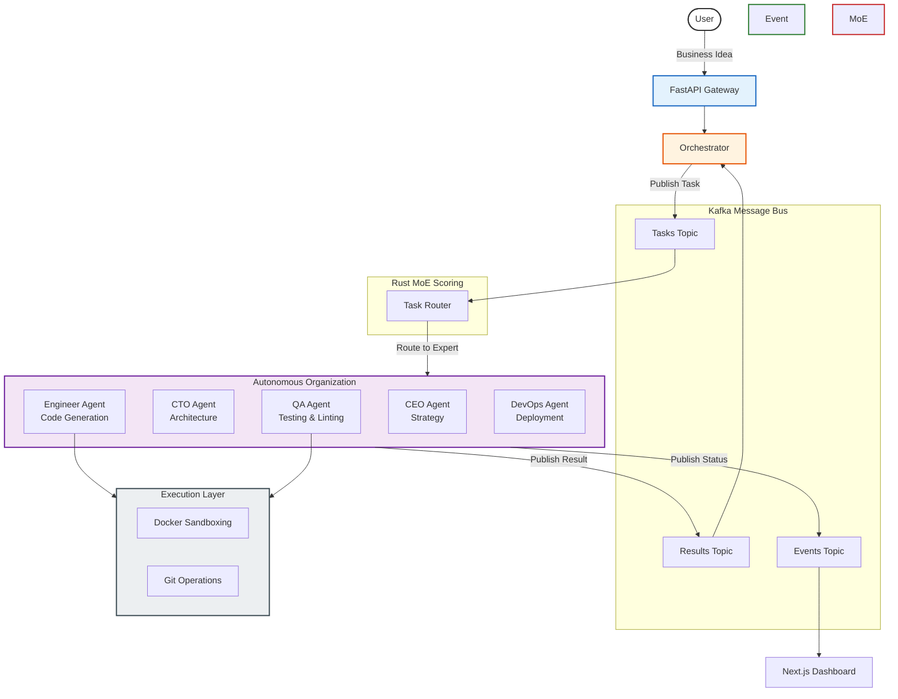

# Autonomous Multi-Agent AI Organization

> A production-grade, event-driven, AWS/Kubernetes deployable system where AI agents autonomously build and deploy real software from a single business idea.

---

## Overview

Build autonomous, reliable, multi-agent workflows without hardcoding linear steps. Define your goal through a business idea, and the framework utilizes a Mixture-of-Experts (MoE) engine to route sub-tasks, while agents communicate asynchronously over a Kafka event bus.

### The Advantage

| Traditional Frameworks     | This Organization                      |
| -------------------------- | -------------------------------------- |
| Hardcode agent workflows   | Event-driven Kafka message bus         |
| Synchronous execution      | Asynchronous, parallel agent execution |
| Static tool configurations | Dynamic Docker workspace sandboxing    |
| Simple LLM calling         | High-Performance Rust MoE routing      |

## Architecture



## Quick Start

### Prerequisites

- Python 3.11+
- [Docker](https://docs.docker.com/get-docker/) and Docker Compose
- Node.js 20+ (for the dashboard)
- Git

> **Note for Windows Users:** It is strongly recommended to use **WSL (Windows Subsystem for Linux)** or **Git Bash** to run this framework. Some core execution tools and sandboxing environments rely on Linux-native semantics.

### Installation

```bash
# Clone the repository
git clone https://github.com/DsThakurRawat/Autonomous-Multi-Agent-AI-Organization.git
cd "Autonomous Multi-Agent AI Organization"

# Set up the Python environment (Linux / macOS / Windows WSL)
python3 -m venv venv
source venv/bin/activate

# On Windows (Git Bash or Command Prompt without WSL):
# python -m venv venv
# .\venv\Scripts\activate

# Install dependencies
pip install -r requirements.txt

# Install Dashboard dependencies
cd dashboard
npm install
cd ..

# Configure Environment Variables
cp .env.example .env
```

Open `.env` and provide your configuration, including your Google Gemini API key and Kafka broker URLs.

### Running the System

Start the infrastructure and services via Docker:

```bash
docker-compose up --build
```

Access the real-time observability dashboard by navigating to: `http://localhost:3000`

## Agents & Responsibilities

| Agent | Responsibility | Core Tools |
|-------|---------------|-------|
| **CEO** | Strategy, Vision mapping, User interactions | Planning |
| **CTO** | Architecture planning, tech stack, delegation | Design, Schema generators |
| **Engineer** | Writing actual application code | Git, Linters, Bash Sandboxes |
| **QA** | Testing, Static Analysis, Verification | Pytest, coverage, rustc |
| **DevOps** | Deployment pipelines, containerization | Docker, Kubernetes, AWS CLI |
| **Finance** | Cloud cost tracking & limits | Cost estimation APIs |

## Security & Sandboxing

- **Execution Sandboxes:** Agents execute code within temporary, isolated Docker containers to prevent harm to the host system.
- **API Key Management:** Keys are injected via Kubernetes Secrets / AWS Secrets Manager.
- **Least Privilege:** AI agents strictly receive only the tools necessary for their explicitly defined scoped tasks.

## Deployment

The system is fully Kubernetes-native and can be deployed to production environments using the provided Helm charts located in `infra/helm/ai-org/`.

## Upcoming Architectural Roadmap

Based on recent deep analyses of leading open-source agent frameworks (`hive`, `moltbot`, `cli`), our roadmap includes:

1. **Agent Rewinding & Checkpointing**: Implementing a shadow Git branch tracker to allow instant rollback of agent states if they spiral off course.
2. **Adaptive Self-Healing Loops**: Replacing static pipelines with a Goal-Driven Graph that automatically recalculates and retries on QA/DevOps failure.
3. **Unified Control Gateway**: Moving beyond the CLI to a WebSockets-based Gateway exposing agents to Discord, Slack, and other external channels.
